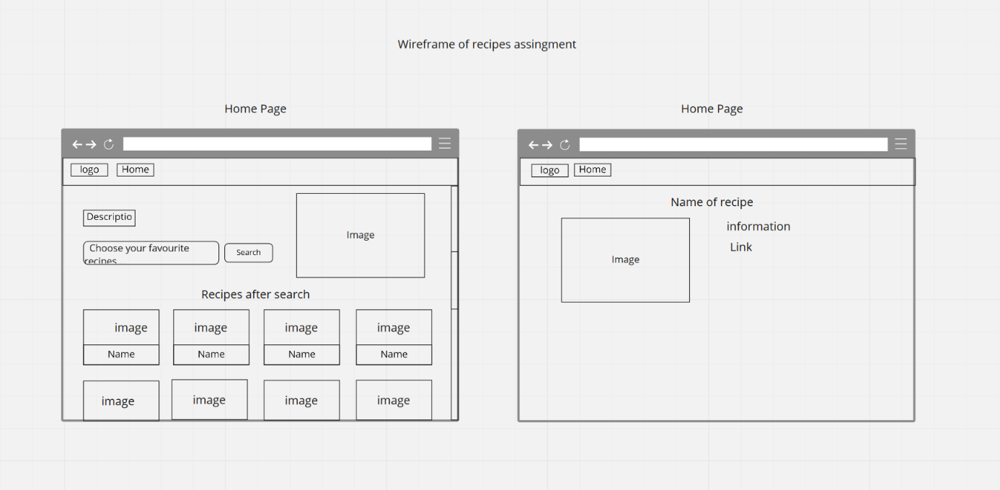

# Atypon-assignment

## Get Start
```
yarn install
```

### Compiles and hot-reloads for development
```
yarn serve
```

### Compiles and minifies for production
```
yarn build
```

### Run your unit tests
```
yarn test:unit
```

### Run your end-to-end tests
```
yarn test:e2e
```

### Lints and fixes files
```
yarn lint
```

### Note: if you want to run the code you have to

1. Create .env file
2. paste  REACT_APP_BASE_URL=REACT_APP_BASE_URL=https://api.spoonacular.com/recipes
3. paste your apiKey after you get it from api website as following : REACT_APP_API_KEY= YOUR_API_KEY 


### Customize configuration
See [Configuration Reference](https://reactjs.org/docs/getting-started.html).

# Design decisions

1. At the begining i started draw wire fram as appear below 



2. In some component i used bootstrap like RiCloseLine RiMenu3Line and also seemore feature 

3. In some components i used UI Material like loading progress 

4. In general I create css file for each component but actually i use some of variables in index.css

# Highlights and lessons learn 

1. What i would highlight to is that if i have more time i can do some special features like pagination and add new feature like categorize searching 

2. What i learn while i build this application is how to managing my time to finish two features just in 8 hours and also how to write unit test react application 
